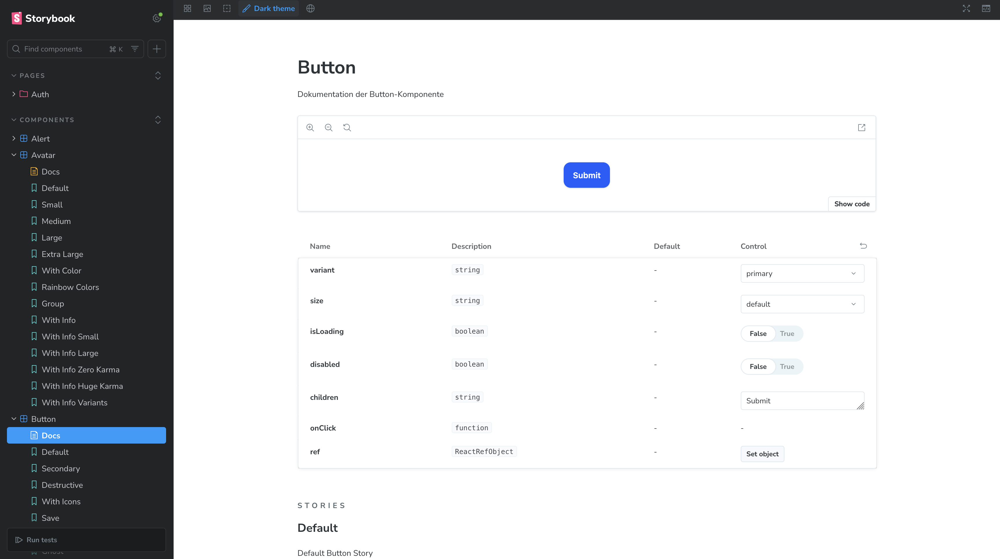
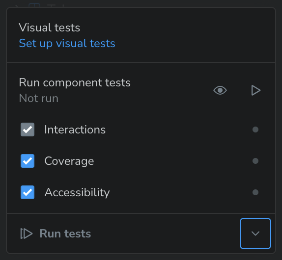
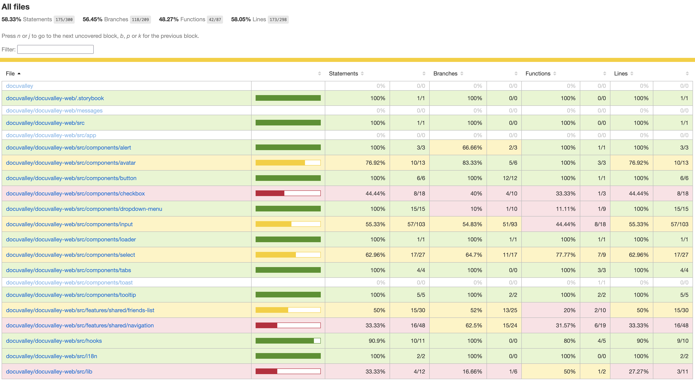
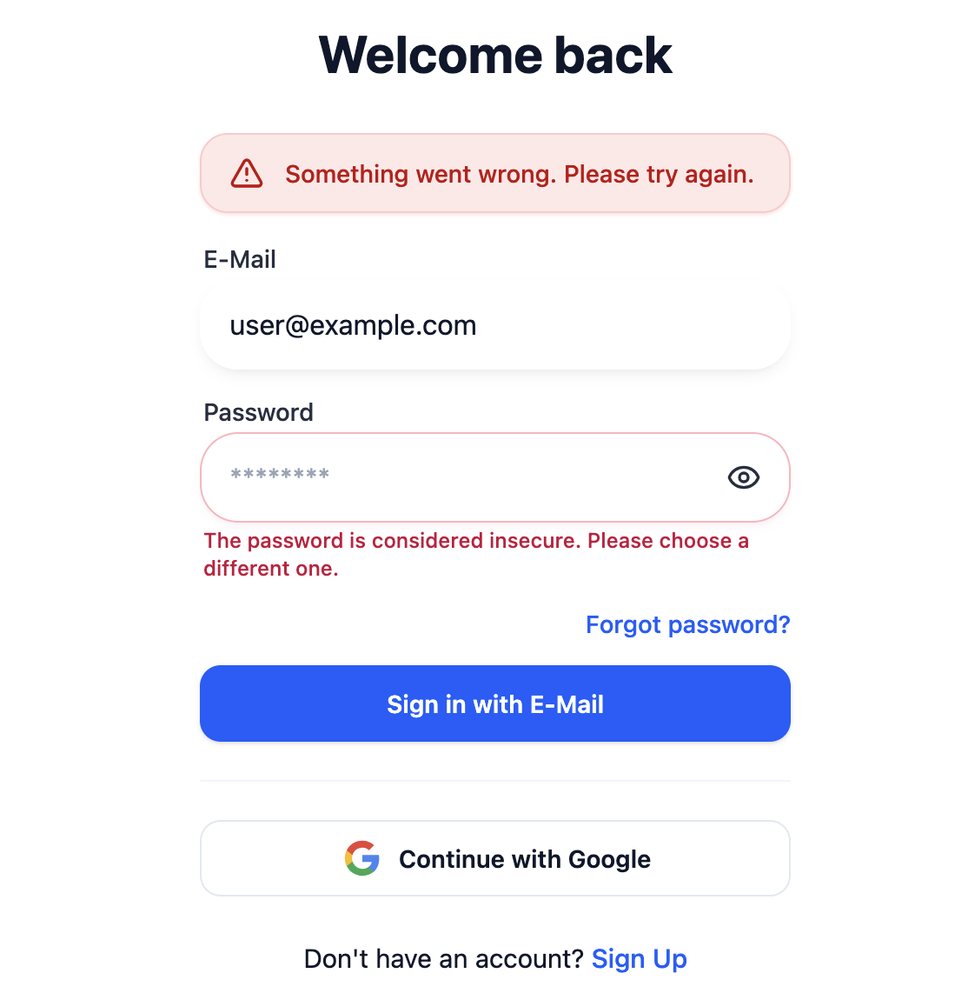

# WPF - Storybook Zusammenfassung

## Was ist Storybook?

Mit Storybook können UI-Komponenten isoliert entwickelt und getestet werden.
Dazu wird ein Node-Server gestartet, welcher alle erstellten Stories erkennt und organisiert anzeigt.



Zusätzlich können alle Komponenten individuell mit MDX dokumentiert werden, um z. B. anderen Teammitgliedern die Verwendung zu erleichtern.

## Version

Am 28. Oktober 2025 wurde Storybook 10 [released](https://github.com/storybookjs/storybook/releases/tag/v10.0.0). Die Hauptänderung ist die vollständige Migration zu ESM.

## Setup von Storybook

Nachdem Storybook mit `npx storybook init` eingerichtet wurde, findet man einen neuen Ordner `.storybook` mit drei Dateien vor: `main.ts`, `preview.ts` und `vitest.setup.ts`. Zudem wird ein Beispielsetup innerhalb von `/components` und eine `vitest.config.ts` für Komponenten-Tests hinzugefügt.

In `.storybook/main.ts` werden u. a. Framework und Add-ons konfiguriert, z. B. für die automatische Erkennung von a11y-Fehlern. Folgende Add-ons sind per-default mit enthalten:

| Add-on                          | Kurzbeschreibung                                                                                                                   |
| ------------------------------- | ---------------------------------------------------------------------------------------------------------------------------------- |
| **@chromatic-com/storybook**    | Verbindet Storybook mit [Chromatic](https://www.chromatic.com/), um visuelle Regressionstests und Review-Workflows zu ermöglichen. |
| **@storybook/addon-docs**       | Erzeugt automatisch interaktive Komponenten-Dokumentation direkt aus Stories und TSDoc-Kommentaren.                                |
| **@storybook/addon-onboarding** | Zeigt eine geführte Einführung in Storybook, wird nach dem Setup meist entfernt.                                                   |
| **@storybook/addon-a11y**       | Prüft Komponenten auf Accessibility-Fehler (z. B. Kontrast, ARIA-Labels) direkt in der UI.                                         |
| **@storybook/addon-vitest**     | Bindet Vitest-Testergebnisse in Storybook ein, erzeugt zudem Test-Coverage                                                         |

`.storybook/preview.ts` legt den Kontext für alle Stories fest. Ebenso werden Einstellungen für verwendete Add-ons konfiguriert. Ein Beispiel ist die Behandlung von in Tests gefundenen a11y-Fehlern:

```tsx
// So werden a11y-Fehler in Komponenten als Todo markiert.
// Dies wird beim Setup vorkonfiguriert.
a11y: {
  test: 'todo',
}
```

Zusätzlich wurde ein Theme Toggler nachkonfiguriert, bereitgestellt vom Add-on `@storybook/addon-themes`. Da in der Anwendung mehrere Sprachen bzw. i18n mit dem Softwarepaket `next-intl` implementiert wird, benötigt man für die Darstellung von i18n-Komponenten ein weiteres Add-on: `storybook-next-intl`. So kann Storybook die Texte verarbeiten und innerhalb der UI die Sprache gewechselt werden (zum jetzigen Entwicklungsstand wird nur Englisch unterstützt). Dieses Add-on wird allerdings von einer [Einzelperson entwickelt](https://www.npmjs.com/package/storybook-next-intl), nicht von Storybook selbst. Auf der Storybook Seite wird es aber als [Add-on aufgeführt](https://storybook.js.org/addons/storybook-next-intl).

Die Datei `storybook/vitest.setup.ts` dient als Setup-Datei für Vitest, um die Testumgebung von Storybook zu initialisieren.

Neben den Dateien werden in der `package.json` zwei neue Skript hinzugefügt:

```json
// Startet den Storybook Dev Server
"storybook": "storybook dev -p 6006",

// Baut eine statische Webseite, die z. B. für Dokumentationszwecke gehostet werden kann
"build-storybook": "storybook build"
```

## Was sind Stories und wie sind diese aufgebaut?

Eine UI-Komponente besitzt meist eine Reihe von Argumenten (Props), welche die Komponente hinsichtlich Funktion oder Aussehen verändern. Um Argumente in verschiedenen Kombinationen zu visualisieren, verwendet man Stories.

### Erstellung von Stories

Stories werden in eine `.stories.`-Datei geschrieben. Damit Stories geschrieben werden können, wird eine Komponente wie ein Button benötigt. Dieser liegt z. B. unter `/components/button/button.tsx`.

In der Datei `/components/button/button.stories.tsx` wird zuerst ein Meta-Objekt für die Stories erstellt:

```ts
const meta: Meta<typeof Button> = {
  title: "Components/Button",
  component: Button,
  tags: ["autodocs"], // Generiert Docs für Argumente
  argTypes: {
    // Liste von verfügbaren Argumenten
  },
  args: {
    // Default Argumente, welche Stories einem Button übergeben
    variant: "primary",
    size: "default",
    isLoading: false,
    disabled: false,
  },
} satisfies Meta<typeof Button>;
```

Nun können verschiedene Zustände des Buttons mit Stories veranschaulicht werden.

```ts
type Story = StoryObj<typeof meta>;

// button.stories.tsx
export const Default: Story = {
  args: {
    children: "Submit",
  },
};

// Farbe: Secondary
export const Secondary: Story = {
  args: {
    variant: "secondary",
    children: "Secondary",
  },
};

// Lade-Zustand
export const Loading: Story = {
  args: {
    children: "Submitting",
    isLoading: true,
  },
};
```

Mit `pnpm storybook` wird der Server auf Port 6006 gestartet, und die Komponenten-Zustände bzw. Stories können eingesehen werden.

Ein weiteres Beispiel ist ein Form Input:

```tsx
const meta: Meta<typeof Input> = {
  title: "Components/Input",
  component: Input,
  // ...
  args: {
    label: "E-Mail",
    placeholder: "example@mail.com",
    leadingIcon: <Mail size={18} />,
  },
} satisfies Meta<typeof Input>;

// ...

export const Default: Story = {
  args: {
    type: "email",
  },
};

export const Password: Story = {
  args: {
    label: "Password",
    type: "password",
    placeholder: "•••••••••••",
    leadingIcon: <Lock size={18} />,
  },
};
```

Damit kann u. a. ein Form Input zu einem E-Mail oder Passwort Input konfiguriert werden.

## Testing

Die wichtigsten Arten von Tests in Stories sind Interaction- und Accessibility-Tests.

Interaction-Tests werden innerhalb von Stories im `play:`-Attribut mit `@storybook/test` geschrieben. Ein simpler Interaction-Test für unsere Button-Komponente könnte z. B. so aussehen:

```ts
export const Default: Story = {
  args: {
    children: "Submit",
    onClick: fn(),
  },
  play: async ({ canvasElement, args }) => {
    const canvas = within(canvasElement);
    const button = canvas.getByRole("button", { name: /submit/i });

    await expect(button).toBeInTheDocument();
    await expect(button).toHaveTextContent("Submit");
    await expect(button).not.toBeDisabled();

    await userEvent.click(button);

    await expect(args.onClick).toHaveBeenCalledTimes(1);
  },
};
```

Accessibility-Tests werden, anders als Interaction-Tests, mithilfe des `@storybook/addon-a11y` Add-ons generiert. Das Add-on verwendet intern Axe für die a11y-Prüfung.

Links unten in der Storybook Oberfläche findet man das Test-Menü, mit welchem Interaction-Tests und/oder a11y-Tests ausgeführt werden können:



Optional kann auch die Test-Coverage aktiviert werden:



Der Test-Coverage Report wird durch das Vitest-Add-on erzeugt. Sowohl die Ausführung der einzelnen Stories für eine Komponente, als auch Interaction-Tests zählen mit in die Test-Coverage.

Sollte man Tests lieber über das CLI ausführen, können mit

```sh
vitest --project=storybook
```

bzw.

```sh
vitest --project=storybook --coverage
```

ebenfalls die Storybook Tests ausgeführt werden. Dies ist durch die automatische Storybook-Konfiguration in `vitest.config.ts` beim Setup möglich.

Neben den zwei genannten Test-Arten gibt es noch [visuelle Tests](https://storybook.js.org/docs/writing-tests/visual-testing). Mit diesen kann das tatsächliche Aussehen der Komponenten geprüft werden bzw. mit letzten "guten" Snapshots verglichen werden. Dabei muss [kein Code geschrieben oder gewartet werden](https://storybook.js.org/blog/visual-testing-is-the-greatest-trick-in-ui-development). Allerdings können diese nur mit Chromatic in der Cloud, einem visuellen Testing-Tool, durchgeführt werden. Dafür wird ein Account bei Chromatic benötigt.

Anmerkung: [Snapshot-Tests](https://storybook.js.org/docs/writing-tests/snapshot-testing) sind auch noch eine Testart, werden allerdings von Storybook nicht mehr empfohlen bzw. nicht als Best Practice angesehen. Dies liegt an aufwendigen Wartungen und zu vielen Informationen.

## Anwendungsfälle

Während bis jetzt hauptsächlich einzelne, simple gehaltene Komponenten behandelt wurden, gibt es weitaus komplexere Anwendungsfälle, z. B. logische Komponenteneinheiten wie eine Navigation Bar oder ganze Seiten/Pages.

### Navigation Bar

Die Navigation Bar der Anwendung akzeptiert als Argument eine Session. Sollte keine Session vorhanden sein, werden einige Elemente, wie der Upload-Button, nicht angezeigt.

Wie bereits oben, definieren wir ein Meta-Objekt und im Anschluss Stories:

```tsx
import messages from "@/../messages/en.json";
// ...Andere Importe

const meta = {
  title: "Features/Navigation",
  component: Navigation,
  parameters: {
    // Damit die Navigation Bar korrekt gerendert wird
    layout: "fullscreen",
  },
  tags: ["autodocs"],
  decorators: [
    // Die Navigation Bar verwendet i18n-Texte,
    // deshalb brauchen wir den i18n-Provider.
    (Story) => (
      // Der Provider erkennt hier locale und messages nicht,
      // deshalb übergeben wir es manuell.
      <NextIntlClientProvider locale="en" messages={messages}>
        <Story />
        <div className="h-22" />
      </NextIntlClientProvider>
    ),
  ],
} satisfies Meta<typeof Navigation>;

// ...

const mockSessionLoggedIn = {
  // ...
};

export const LoggedIn: Story = {
  args: {
    session: mockSessionLoggedIn,
  },
};

export const LoggedOut: Story = {
  args: {
    session: undefined,
  },
};
```

Zweck ist, dass sowohl der ausgeloggte als auch eingeloggte Zustand der Navigation Bar angeschaut und bearbeitet werden kann, ohne von der Anwendung bzw. der Session abhängig zu sein.

Weiterhin könnte eine Story sinnvoll sein, in welcher der Nutzer einen langen Namen hat, um z. B. ungewollte Verschiebungen der anderen Elemente effektiv behandeln zu können:

```ts
export const WithLongName: Story = {
  args: {
    session: {
      ...mockSessionLoggedIn,
      user: {
        ...mockSessionLoggedIn.user,
        name: "Sehr sehr sehr langer Name 123",
        avatarFallback: "S",
      },
    },
  },
};
```

### Composite Pattern

Wenn Komponenten nach dem Composite Pattern aufgebaut sind (mehrere kleine, voneinander abhängige Bausteine wie SelectTrigger, SelectContent, SelectItem usw.), lassen sich in Storybook gezielt einzelne Kombinationen oder Zustände dieser Teile visualisieren. So kann geprüft werden, ob das Zusammenspiel funktioniert bzw. Interaktionen korrekt sind.

Als Beispiel dient hier ein Select:

```tsx
export const Default: Story = {
  render: () => (
    <Select>
      <SelectTrigger className="w-[280px]">
        <SelectValue placeholder="Select a fruit" />
      </SelectTrigger>
      <SelectContent>
        <SelectItem value="apple">Apple</SelectItem>
        <SelectItem value="banana">Banana</SelectItem>
        <SelectItem value="blueberry">Blueberry</SelectItem>
      </SelectContent>
    </Select>
  ),
};

export const InForm: Story = {
  render: () => (
    <div className="w-[400px] space-y-4">
      <div className="space-y-2">
        <p className="ml-0.5 text-sm font-medium">Language Preference</p>
        <Select defaultValue="en">
          <SelectTrigger>
            <SelectValue placeholder="Select a language" />
          </SelectTrigger>
          <SelectContent>
            <SelectItem value="en">English</SelectItem>
            <SelectItem value="de">Deutsch</SelectItem>
            <SelectItem value="fr">Français</SelectItem>
          </SelectContent>
        </Select>
        <p className="ml-0.5 text-xs text-muted-foreground">
          Choose your preferred language.
        </p>
      </div>
    </div>
  ),
};
```

Hier kann man sehen, wie man die Composite-Komponente korrekt zusammensetzt, und wie sie in Kontexten wie einer Form aussieht.

Anmerkung: Mit dem [CSF 3 Format](https://storybook.js.org/blog/component-story-format-3-0) kann die render-Funktion weggelassen werden. Da hier allerdings die Komponente zusammengesetzt werden muss, wird eine render-Funktion benötigt.

### Sign-In Seite

Da es oft hilfreich ist, auch komplette Seitenzustände isoliert zu betrachten und zu testen, werden im Folgenden Stories für die Sign-In Seite (`/src/app/[locale]/(auth)/sign-in/page.tsx`) erstellt.

Zu beachten ist, dass die Funktion der übergeordneten Sign-In Seite asynchron ist:

```tsx
export default async function SignInPage({
  // async
  searchParams,
}: Readonly<OryPageParams>) {
  const flow = await getLoginFlow(config, searchParams);

  if (!flow) {
    return;
  }

  return (
    <div className="flex flex-col items-center">
      <SignInForm initialFlow={flow} returnTo="/" />
    </div>
  );
}
```

Da asynchrone Funktionen nicht im Browser gerendert werden können (diese brauchen den Node-Serverkontext), wird anstelle dessen die Client-Komponente `SignInForm` verwendet. So kann der Login-Flow als Argument übergeben und beliebig angepasst werden. So kann z. B. ein "Invalid Credentials" Fehler im Flow gemocked werden, um die Sign-In Seite im Error-Zustand ansehen zu können:

```tsx
const mockFlow: LoginFlow = {
  /* ... */
};
const mockLoginResponse: SuccessfulNativeLogin = {
  /* ... */
};

const meta: Meta<typeof SignInForm> = {
  title: "Pages/Auth/SignInPage",
  // Sign-In Form, da die übergeordnete Seite asynchronous ist.
  component: SignInForm,
  // ...
  args: {
    initialFlow: mockFlow, // Mock-Flow übergeben
    returnTo: "/",
  },
  beforeEach: () => {
    // Damit die Flow Response angepasst werden kann
    frontendApi.updateLoginFlow = fn().mockResolvedValue(mockLoginResponse);
  },
};

// ...

export const PageLike: Story = {
  play: async ({ canvasElement }) => {
    /* ... */
  }, // Interaction Test für die Form
};

export const WeakPassword: Story = {
  args: {
    initialFlow: mockFlow,
  },
  beforeEach: () => {
    const weakPasswordFlow: LoginFlow = {
      ...mockFlow,
      id: "weak-password-flow",
      ui: {
        ...mockFlow.ui,
        nodes: [
          {
            type: "input",
            group: "password",
            attributes: {
              name: "password",
              // ...
            },
            // Fehler im Passwort-Feld definieren, damit der Fehler auf "Field"-Ebene angezeigt wird
            messages: [
              {
                // ...
                text: "The password is considered insecure. Please choose a different one.",
                // ...
              },
            ],
          },
        ],
      },
    };

    // ResponseError mit schwachem Passwort-Flow mocken.
    // Der Fehler wird erst nach dem Formular-Submit angezeigt,
    // wenn der API-Call einen ResponseError zurückgibt.
    const error = new ResponseError(
      new Response(JSON.stringify(weakPasswordFlow), {
        status: 400,
        headers: { "Content-Type": "application/json" },
      })
    );

    frontendApi.updateLoginFlow = fn().mockRejectedValue(error);
  },
  // Interaction-Test, der ein falsches Passwort eingibt
  play: async ({ canvasElement }) => {
    /* ... */
  },
};

export const InvalidCredentials: Story = {
  args: {
    initialFlow: {
      ...mockFlow,
      id: "invalid-credentials-flow",
      ui: {
        ...mockFlow.ui,
        messages: [
          {
            // ...
            text: "The provided credentials are invalid.",
            // ...
          },
        ],
      },
    },
  },
};
```

Zur Veranschaulichung ist hier dargestellt, wie ein Field-Error beim Password-Feld in der Weboberfläche aussehen würde.



## Fazit

Der Einsatz von Storybook hat sich in der Entwicklung als sehr nützlich erwiesen. Insbesondere beim Aufbau und der Validierung eigener UI-Komponenten erleichtert das Werkzeug das isolierte Betrachten und Testen einzelner Zustände. Dadurch können komplexe Szenarien, wie Fehler- oder Ladezustände, gezielt simuliert und überprüft werden, ohne auf die gesamte Anwendung angewiesen zu sein.

Zusätzlich bietet die Storybook UI eine schöne und strukturierte Übersicht über die eigenen Komponenten bzw. eigenen UI. Insbesondere, wenn in Teams gearbeitet wird, gibt es möglicherweise einen gemeinsamen Hub für alle Komponenten einer gemeinsam entwickelten Weboberfläche. Diese können dann mit eigenen Dokumentationen versehen werden, um ggf. Unklarheiten proaktiv zu verringern.

Zudem erleichtert die automatische Prüfung der a11y die Erkennung von Fehlern, welche oft nur durch manuelles Debugging mit Browser-Tools auffallen. Weiterhin können durch Interaction-Tests Komponenten auf ihre einzelne Funktionalität im Browser-Kontext getestet werden. Dies ist hilfreich, da Komponenten oft nur in e2e-Tests "mitgetestet" werden. Mit diesem Ansatz können Fehler schon auf Komponenten-Ebene beseitigt werden.

Abschließend halte ich den Einsatz von Storybook für eine sehr sinnvolle Ergänzung im Entwicklungsprozess und plane, es in zukünftigen Webprojekten erneut einzusetzen.
